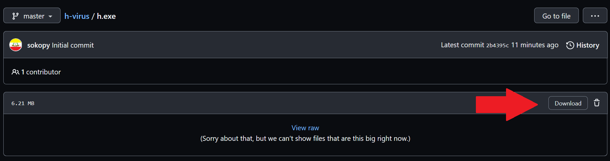
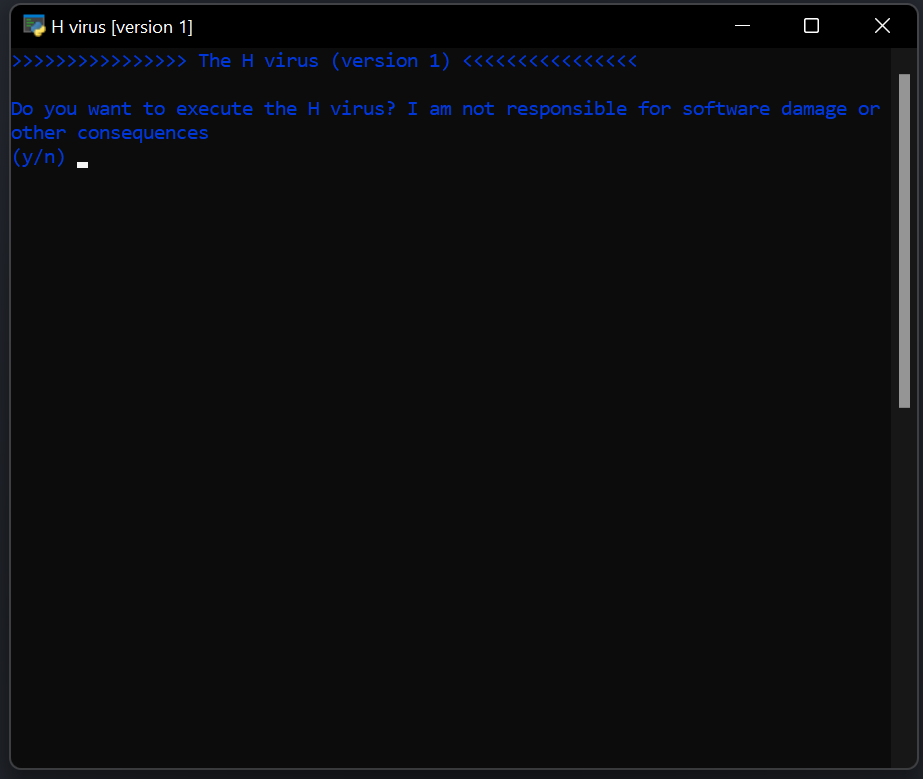
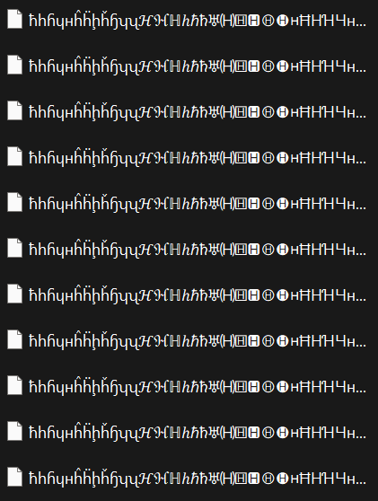

# H virus
The H virus is a simple project that will fill your puter with 65000 files with a bunch of diferent characters that resemble
the glorious and beautiful letter h. This project came to my mind yesterday at 11 PM when I could not sleep and tried thinking about something to do.

## How to use

- ### Install the [executable file](https://github.com/sokopy/h-virus/blob/master/h.exe)

- ### Execute it and type "y" to proceed (or "n" to cancel)

- ### Watch as the virus fills your directory

- ### Regret

